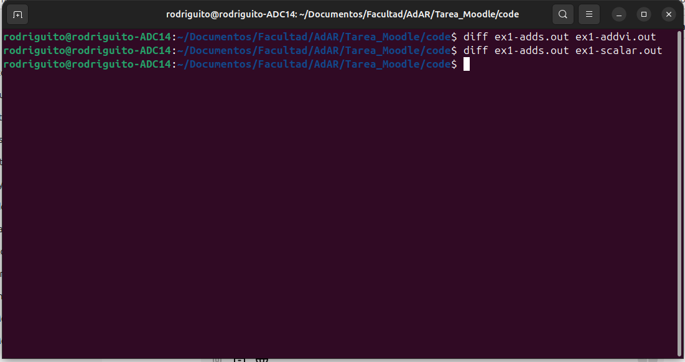
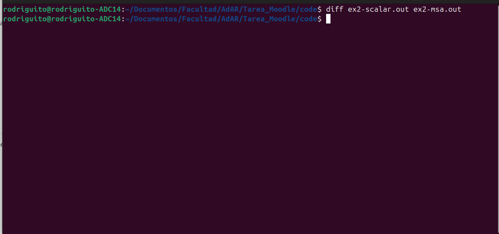

# Arquitecturas de alto rendimiento.

Alumno: **Rodrigo Agustin Quevedo**

## Extensiones multimedia
En este laboratorio se nos propuso entender como funcionan las extensiones multimedia para arquitecturas de alto rendimiento.

### Primer ejercicio

Se nos dejó el siguiente código en C:

    for (i=0;i<16384;i++) {
    if (red[i]< 250)
        red[i] += 5;
    else
        red[i] = 255;
    }

Junto a 2 implementaciones en assembler, una usando adds y otra usando addvi:

    ADDS: Suma dos registros (con signo), y actualiza los flags del CPSR.

    ADDVI: Suma un valor inmediato a un registro, y también puede actualizar los flags del CPSR dependiendo de la arquitectura.

En mi caso compile los 3 programas y luego hice que la salida se guardara en otro archivo y no hay ninguna diferencia:

Para este caso use el comando **diff** de la terminal y nos dice que no hay ninguna diferencia, pueden comprobarlo ya que deje los outputs de cada programa.

### Ejercicio 2

En este caso se nos dejó este otro código en C:

    for (i=0; i<256; i++) {
    a[i]=b[i]+c[i];
    if (a[i]==b[i])
       d[i]=a[i]*3;
    b[i]=a[i]-5;
    }

Y se nos pidió transcribirlo usando la arquitectura **MIPS MSA**.

Donde, en mi caso, tuve problemas principalmente intentando mover posiciones de memoria y guardando valores en los momentos que tenia que hacerlo, ademas de entender que hacian las funciones FADD.D, FCEQ.D, etc. 

En este caso tambien use **diff** de la terminal para hacerlo mucho más sencillo. De todas formas adjudico los resultados en ex2-msa.out y ex2-scalar.out.

**Nota**: No pongo mi código porque lo deje en la parte de "ex2.c" con todo lo que me pareció que podia comentar y creo que es mucho mas legible en esa parte.